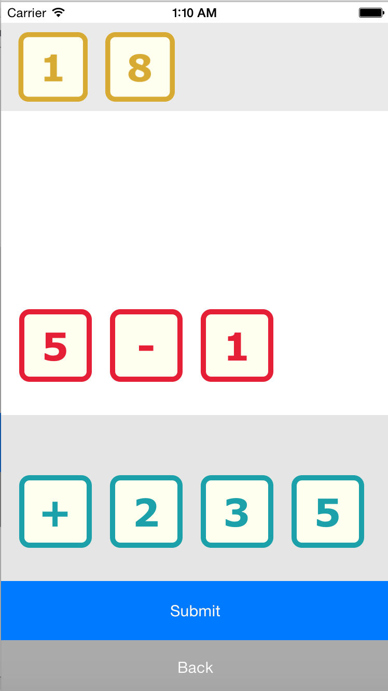

## Equations

[Equations](http://academic-games.org/games/equations/index.html) is a creative and social mathematics game, originally created by Layman Allen. This app is a single-player version of that game developed and inspired by the experiences of Shantanu and Sal who played the game as children.

This app features an interactive drag and drop experience with the tiles, it also hooks into a Parse backend that dynamically updates the levels in the app.
Here are screenshots from the app:

